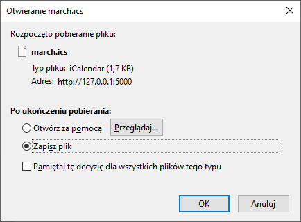

## Prerequisites
* installed python (type 'python --version' in your command line to verify that)
* installed flask (type 'flask --version' in your command line to verify that)
* If both of these commands return correct responses you're good to go!

## Running the script

1. Using an IDE:
Open the project folder in your IDE and run the main.py script.
In your console you should see something like `Running on http://127.0.0.1:5000/`
That means you are good to go!

1. Using command line:
Locate the project folder where the main.py resides.
Run the script using command `python ./main.py`
In your console you should see something like `Running on http://127.0.0.1:5000/`
That means you are good to go!

## API functionality
This api can be accessed through two endpoints determining the month of the calendar, and returns an ics calendar file containing the
data of events from the http://www.weeia.p.lodz.pl/ website calendar:
Endpoint | Response
------------ | -------------
http://127.0.0.1:5000/march | downloadable `march.ics` file containing events from weeia main page
http://127.0.0.1:5000/october | downloadable `october.ics` file containing events from weeia main page

## Example response
Accessing the endpoint `http://127.0.0.1:5000/march` the api would respond with:

Which contains all the events data pulled from http://www.weeia.p.lodz.pl/ regarding the month of march 2020.

## Using the ics file
After you download the .ics file, you should be able to use it in almost any calendar app by importing it.  
For instance for Google Calendar just go to `Settings->Import & Export` and import the file from your disk there.
All the events should be successfully added to your calendar.