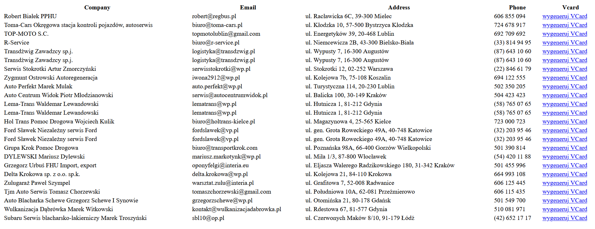
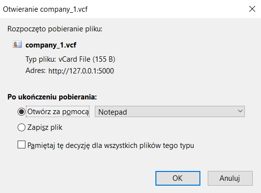

## Prerequisites
* installed python (type 'python --version' in your command line to verify that)
* installed flask (type 'flask --version' in your command line to verify that)
* If both of these commands return correct responses you're good to go!

## Running the script

1. Using an IDE:
Open the project folder in your IDE and run the main.py script.
In your console you should see something like `Running on http://127.0.0.1:5000/`
That means you are good to go!

1. Using command line:
Locate the project folder where the main.py resides.
Run the script using command `python ./main.py`
In your console you should see something like `Running on http://127.0.0.1:5000/`
That means you are good to go!

## API functionality
This api returns and html page containing company data with generated vcards
for results based on a search performed on `https://panoramafirm.pl/szukaj` website with a given user query.
Endpoint | Response
------------ | -------------
http://127.0.0.1:5000/vcf/{query} | company data & vcards from `https://panoramafirm.pl/szukaj?k={query}`

## Example response
Accessing the endpoint `http://127.0.0.1:5000/vcf/mechanik` the api would respond with following page:

Which contains search data pulled from `https://panoramafirm.pl/szukaj` using the `mechanik` 
search query. Links in the Vcard column all contain downloadable vcf files, clicking any of them
results in a download file prompt like this:

## Using the vcf file
After you download the .vcf file, you should be able to open it on your mobile phone.  
Following the file opening, the contact information contained in the file should automatically
be imported into your phone's contact list.